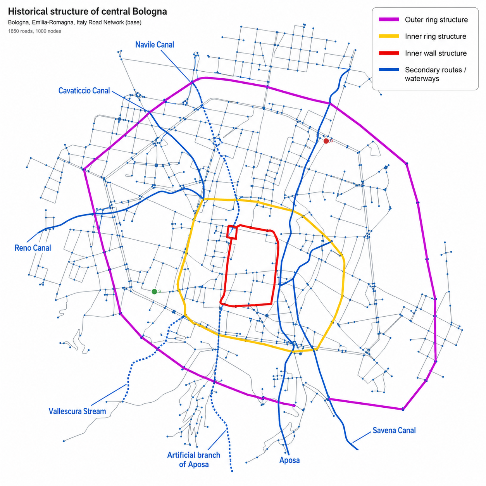
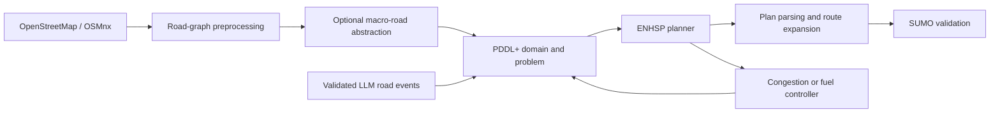
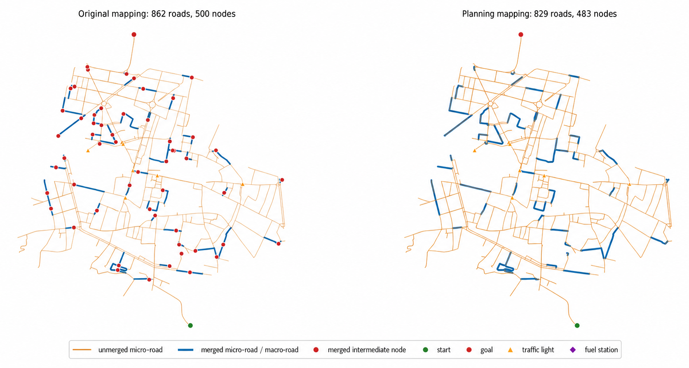
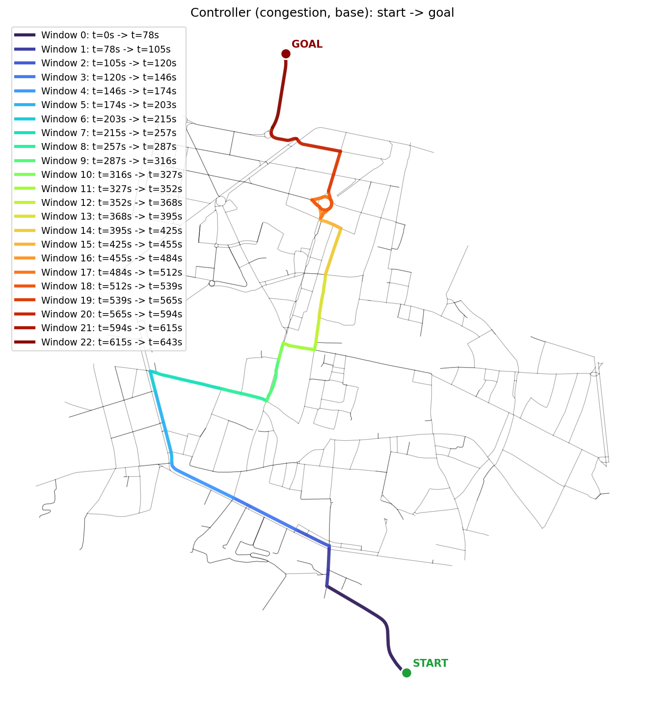
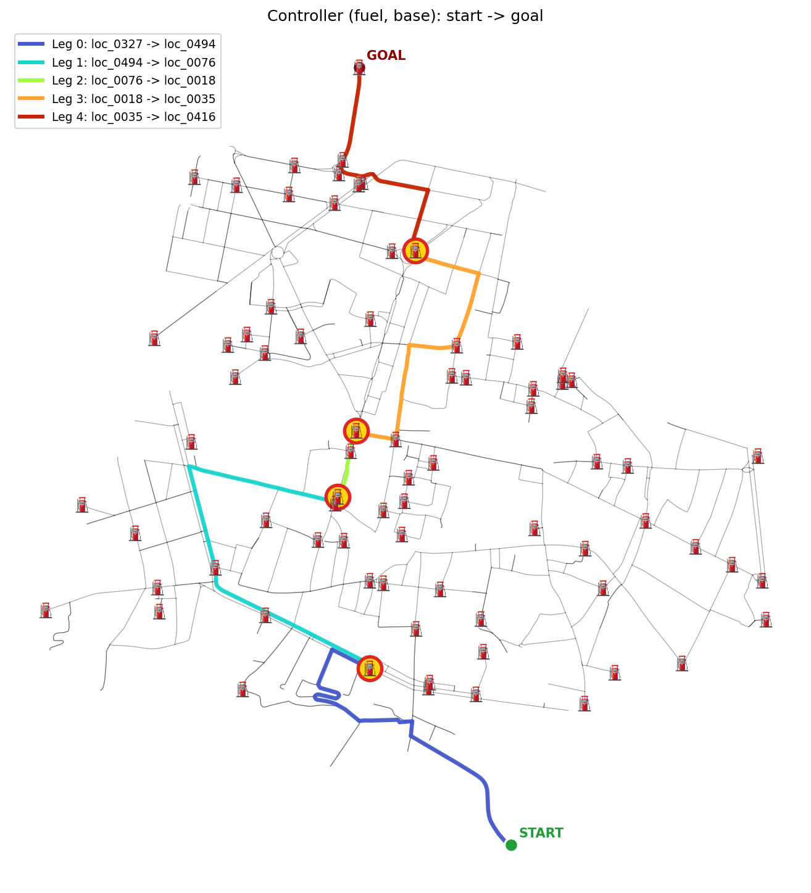

<div align="center">

# Routly Planner

**Scalable PDDL+ urban routing over real road networks**


*Model simplification, step-by-step replanning, and validated LLM road events*

</div>

> **Project status:** completed research prototype developed for the Automated
> Planning course at the University of Calabria, A.Y. 2025/2026. The repository
> is maintained as a reproducible academic artifact rather than a
> production-ready navigation service.

## Overview

Routly is an experimental framework for automated urban route planning on real
OpenStreetMap networks. It converts a road graph into a configurable PDDL+
planning problem, delegates route synthesis to ENHSP, and validates the
resulting plan in SUMO.

Unlike a conventional shortest-path implementation, Routly studies how a
single symbolic model can combine logical constraints, numeric costs, temporal
processes, traffic lights, congestion, road closures, and fuel availability.
The Bologna road network is used as the primary case study.

<p align="center">
  
</p>

## Research questions

The project evaluates three complementary questions.

| Research question | Focus |
|---|---|
| **RQ1 - Model-side scalability** | How much can compilation and graph abstraction reduce grounding and planning cost? |
| **RQ2 - Controller-side scalability** | Can a detailed PDDL+ task be solved at larger scales by decomposing it into smaller planning calls? |
| **RQ3 - LLM event generation** | Can a language model generate relevant road disruptions without access to the original route? |

## System architecture



The implementation separates three responsibilities:

- **Python** constructs the graph, generates PDDL, validates events, manages
  decomposition, and records experiment artifacts.
- **ENHSP** remains responsible for symbolic plan generation.
- **SUMO** provides microscopic route simulation and visual validation.

The LLM does not replace the planner. It proposes structured closures or
slowdowns from topology and start/goal information; Python validates the
proposal before ENHSP computes a new route.

## Planning formulations

Routly exposes three independent modelling axes:

| Axis | Alternatives | Purpose |
|---|---|---|
| Traversal model | `process`, `compiled_duration` | Preserve continuous PDDL+ semantics or compile traversal into direct durative actions |
| State representation | `node_based`, `line_graph` | Represent the vehicle at locations or on roads |
| Action generation | `parameterized`, `compiled` | Let ENHSP ground generic schemas or emit only valid actions in Python |

These axes produce the five evaluated formulations:

| Code | Traversal | State | Actions |
|---|---|---|---|
| PNP | Process | Node-based | Parameterized |
| CNP | Compiled duration | Node-based | Parameterized |
| CNC | Compiled duration | Node-based | Compiled |
| CLP | Compiled duration | Line graph | Parameterized |
| CLC | Compiled duration | Line graph | Compiled |

Macro-road abstraction provides an additional preprocessing optimization. It
merges linear chains whose intermediate nodes do not represent planning
decisions, while protecting intersections, start and goal locations, traffic
lights, and fuel stations.



## Replanning and route adaptation

The model-side and controller-side approaches address different sources of
complexity:

- **Model-side optimization** reduces the number of candidate groundings and
  retained planning structures before search.
- **Congestion control** solves one static traffic snapshot at a time and
  executes only a valid prefix before replanning.
- **Fuel control** selects the final goal when reachable, or a reachable fuel
  station as the next temporary target.
- **LLM event generation** creates plan-hidden closures and slowdowns, while a
  deterministic safeguard preserves start/goal validity and solvability.

| Congestion-window replanning | Fuel-aware replanning |
|---|---|
|  |  |

The following experiment compares the baseline and recalculated routes after a
validated LLM-generated disruption. The LLM receives the topology but never
the hidden baseline plan.

<p align="center">
  
</p>

## Experimental findings

Experiments use reproducible YAML snapshots, the Bologna road network, and an
8 GB Java heap for ENHSP.

| Question | Main finding |
|---|---|
| **RQ1-A** | On the fixed 300-node instance, compiled node-based actions reduce grounding from 40.379 s to 1.063 s (**38.0×**) and total planning from 41.427 s to 2.542 s (**16.3×**) relative to the node-based parameterized baseline. |
| **RQ1-B** | Both successful compiled formulations solve instances with up to 2,000 requested nodes. |
| **RQ2** | Single-shot process formulations fail from 200 nodes because of memory pressure, whereas congestion and fuel controllers solve instances with up to 700 nodes. |
| **RQ3** | Across 15 final experiments, plan-hidden LLM events target at least one baseline-route road in 73.3% of cases; 60.0% of the relevant event sets unaffected by the safeguard produce a different road sequence. |

These results should be interpreted within the experimental scope. The study
uses one principal city topology, evaluates congestion and fuel controllers
separately, and reports a limited sample of LLM-generated events.

## Reproducibility

### Requirements

- Conda
- Java and the bundled/configured ENHSP JAR
- SUMO for simulation and visual validation
- An Ollama, LM Studio, or Groq endpoint only when LLM events are enabled

### Environment setup

```bash
conda env create -f environment.yml
conda activate routly
```

For LLM-backed experiments, create `.env` from `.env.example` and configure the
provider and model. Groq additionally requires `GROQ_API_KEY`.

### Run the complete pipeline

```bash
python scripts/run_pipeline.py
```

The pipeline executes:

1. map acquisition and simplification;
2. start/goal selection;
3. optional macro-road construction;
4. PDDL domain and problem generation;
5. ENHSP planning or controller-managed replanning;
6. conversion and validation in SUMO.

Useful commands:

```bash
python scripts/run_pipeline.py --help
python scripts/run_pipeline.py 1 4 6
python scripts/run_pipeline.py --resume
python scripts/run_pipeline.py 4 5 6 --resume <experiment-name>
```

When no step number is supplied, the complete pipeline runs. `--resume`
without a value selects the most recent experiment.

## Configuration

Two versioned YAML files control execution:

- [`config/pipeline.yaml`](config/pipeline.yaml) selects and orders the
  pipeline stages.
- [`config/project.yaml`](config/project.yaml) defines the map, planner,
  abstractions, congestion, controllers, fuel, LLM events, and SUMO options.

The production configuration is intentionally compact. Read
[`docs/project.yaml.example`](docs/project.yaml.example) before editing it:
the example documents every option and the compatibility constraints between
planner formulations.

Each run stores a snapshot of the effective configuration alongside its
generated domains, problems, plans, maps, metrics, and simulation artifacts.

## Experiment artifacts

Generated experiments are stored below `data/` and excluded from version
control:

```text
data/<city>/<scenario>/<experiment>/
├── config/                 # Configuration snapshots
├── map/                    # Base and macro-road graph artifacts
├── runs/
│   ├── basic/             # Baseline PDDL, plan and figures
│   └── llm/               # Events, replanned route and comparisons
└── sumo/                   # SUMO network, routes and reports
```

## Repository structure

```text
routly-planner/
├── config/                 # Pipeline and project configuration
├── docs/                   # Report, presentation and technical references
├── domain/                 # Reference PDDL domains
├── images/                 # Curated README figures
├── planners/enhsp/         # ENHSP planner artifact
├── scripts/
│   ├── run_pipeline.py     # Main entry point
│   └── pipeline/           # Individual pipeline stages
└── src/routly/
    ├── controller/         # Congestion and fuel decomposition
    ├── domain/             # Road, congestion, fuel and signal models
    ├── graph/              # Graph conversion and visualization
    ├── llm/                # Structured event prompts
    ├── osm/                # OpenStreetMap acquisition
    ├── pddl/               # Domain/problem generation
    ├── planning/           # ENHSP execution and plan parsing
    └── sumo/               # SUMO export and validation
```

## Documentation

| Document | Contents |
|---|---|
| [Final report](docs/report.pdf) | Research motivation, formalization, implementation, experimental protocol, results, limitations, and future work |
| [Final presentation](docs/presentation.pdf) | Visual overview of the research questions, architecture, scalability strategies, and conclusions |
| [Grounding formulae reference](docs/configurations.pdf) | Derivation and interpretation of the grounding estimates for the five model-side configurations |
| [Annotated project configuration](docs/project.yaml.example) | Complete YAML option reference and valid planner combinations |
| [Report LaTeX source](docs/latex_source/final_report/report.tex) | Reproducible source of the final report |
| [Presentation LaTeX source](docs/latex_source/final_presentation/main.tex) | Reproducible source of the final presentation |

## Limitations and future work

The current implementation keeps the fuel and congestion controllers separate.
The principal extension is a joint hierarchy in which fuel selects the next
reachable target, congestion supplies the current window costs, ENHSP computes
the local route, and Python updates the execution state. Further work includes
online event injection, evaluation on cities with different urban structures,
and a broader statistical assessment of LLM-generated disruptions.

## Academic context

Developed by **S. Cozza, F. Cristiano, E. Ielpa, and G. Rudi** for the
**Automated Planning** course at the **University of Calabria**, academic year
2025/2026.

## License

Released under the [MIT License](LICENSE).
