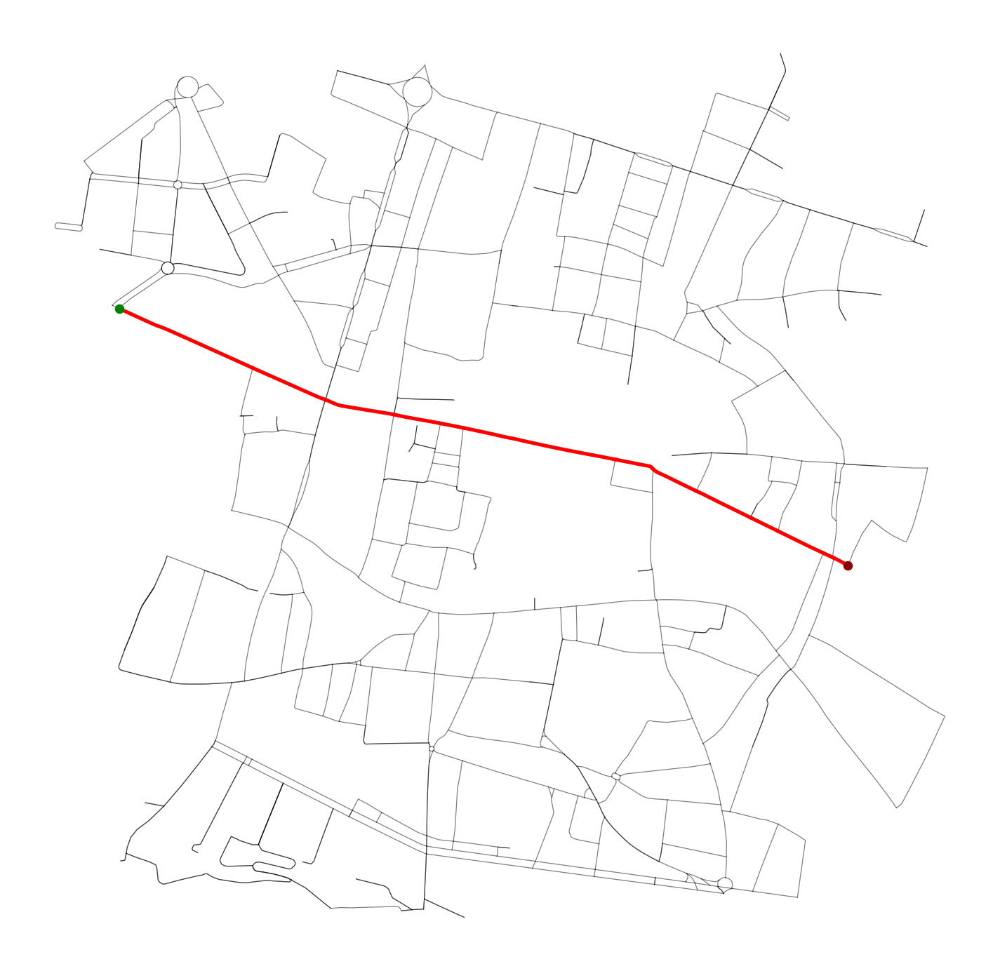
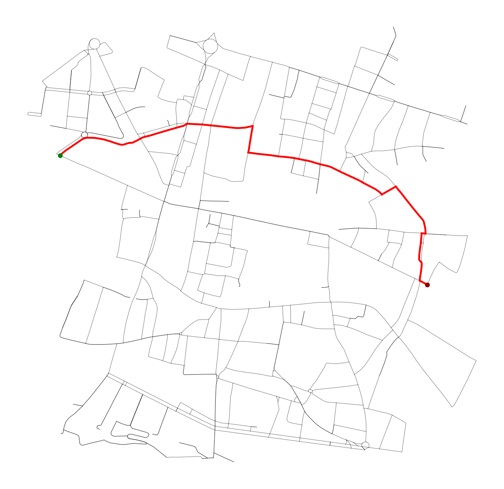
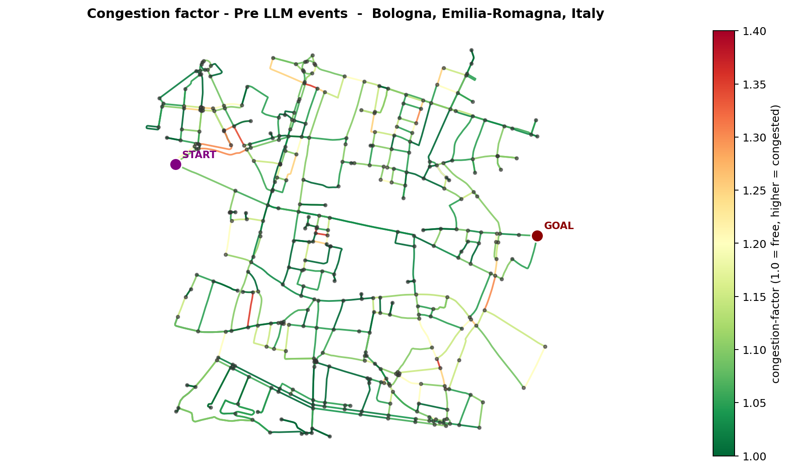
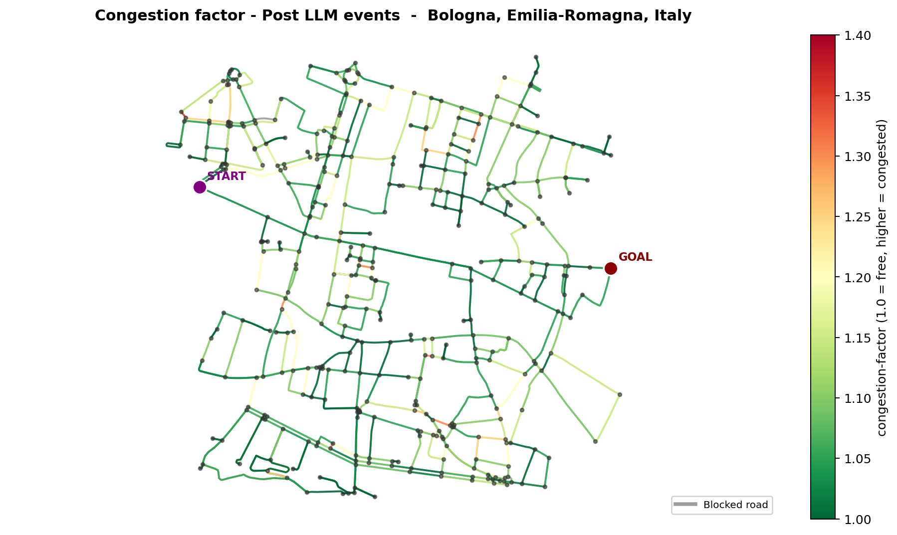

# Routly Planner

Routly Planner builds a PDDL planning problem from a real OpenStreetMap road network, solves the route with ENHSP, and validates the result in SUMO. The current case study uses the road network of Bologna, Italy.

```text
OpenStreetMap
    -> graph simplification and optional macro-roads
    -> PDDL domain and problem
    -> ENHSP plan
    -> optional LLM events or controller replanning
    -> SUMO route validation
```

## Setup

The project uses Conda and Python 3.11:

```bash
conda env create -f environment.yml
conda activate routly
python scripts/run_pipeline.py
```

Java, the configured ENHSP jar, and SUMO are required for the complete pipeline. Useful runner commands are:

```bash
python scripts/run_pipeline.py --help
python scripts/run_pipeline.py <experiment-id> --resume
```

## Configuration

The experiment is controlled by two YAML files:

- `config/pipeline.yaml` selects and orders the pipeline stages.
- `config/project.yaml` configures the map, planner, congestion, fuel, controllers, LLM events, and SUMO.

The main planner settings describe three independent decisions:

| Setting | Values | Question answered |
| --- | --- | --- |
| `planner.traversal_model` | `process`, `compiled_duration` | How is road traversal represented in PDDL? |
| `planner.state_representation` | `node_based`, `line_graph` | Is the vehicle state a node or a road? |
| `planner.action_generation` | `parameterized`, `compiled` | Does ENHSP ground a generic schema, or does Python emit valid actions? |

Other important switches are:

| Setting | Values | Purpose |
| --- | --- | --- |
| `features.road_abstraction.enabled` | `true`, `false` | Enable macro-road compression |
| `features.congestion.mode` | `sumo`, `pddl` | Display congestion in SUMO or pass it to PDDL |
| `features.congestion.type` | `static`, `dynamic`, `hybrid` | Select the temporal congestion model |
| `features.fuel.enabled` | `true`, `false` | Add fuel consumption and refuelling stations |
| `features.llm_events.enabled` | `true`, `false` | Generate road events and a recalculated route |

Valid combinations and their constraints are documented directly in `config/project.yaml`.

## Planning models and scalability strategies

### PDDL+ process

The original model represents traversal with a start action, a continuous process while the vehicle is on the road, and an arrival event. It can represent the vehicle mid-road, but the additional state and numeric evolution increase planner complexity.

```lisp
(:action start-traverse ...)
(:process traverse-road ...)
(:event arrive ...)
```

`process` supports only:

```yaml
planner:
  traversal_model: process
  state_representation: node_based
  action_generation: parameterized
```

This branch is retained for PDDL+ controller experiments. The external controller solves smaller partial plans while preserving processes and events.

### Compiled duration

For start-to-goal routing, the exact position of the vehicle while it crosses a road is not required. `compiled_duration` therefore models the same transition as one direct action with a precomputed duration:

```lisp
(:durative-action traverse-road
 :parameters (?v - vehicle ?r - road ?from ?to - location)
 :duration (= ?duration (travel-duration ?r))
 :condition (at start (and (at ?v ?from) (connects ?r ?from ?to)))
 :effect (at end (and (at ?v ?to) (not (at ?v ?from)))))
```

Action generation can then follow two strategies:

- `parameterized`: ENHSP receives one generic schema and grounds the Cartesian product of its parameters.
- `compiled`: Python generates only valid road/window schemas. Singleton types bind each schema to its road and reduce planner grounding.

The current scalable backend is `compiled_duration + node_based + compiled`.

| Traversal model | State representation | Action generation | Status |
| --- | --- | --- | --- |
| `process` | `node_based` | `parameterized` | Implemented; PDDL+ controller branch |
| `compiled_duration` | `node_based` | `parameterized` | Implemented; generic grounding baseline |
| `compiled_duration` | `node_based` | `compiled` | Implemented; current planner-side optimization |
| `compiled_duration` | `line_graph` | `parameterized` | Recognized future work; not implemented |
| `compiled_duration` | `line_graph` | `compiled` | Recognized future work; not implemented |

In a line graph, the vehicle state is a road and actions represent transitions between connected roads. This can improve the parameterized formulation, but it is not automatically smaller than the current node-based compiled model, which already emits only valid combinations.

## Macro-road abstraction

Macro-roads merge linear chains whose intermediate nodes are not planning decisions. Start, goal, fuel stations, and branching intersections remain protected. The planner works on the compressed mapping, while SUMO receives the expanded sequence of original roads.

The following figure comes from the latest 500-node experiment. It compares the original mapping with the planning mapping and highlights fused intermediate nodes, traffic lights, fuel stations, and the resulting macro-roads. In this run, 90 micro-roads are fused into 41 macro-roads; the planning representation changes from 702 roads and 393 nodes to 676 roads and 383 nodes.


## Route comparison without fuel

This 500-node experiment disables fuel, so the route difference is not influenced by stations or tank constraints. The recalculated plan changes because the LLM-generated events modify road availability or traversal cost.

| Original plan without fuel | Recalculated plan without fuel |
| --- | --- |
|  |  |

The combined event map makes the cause of the deviation explicit: blue is the original route, green is the recalculated route, red marks blocked roads, yellow marks slowdowns, and crosses mark blocked intersections.


## Congestion without fuel

Congestion is shown with fuel disabled so that the maps focus only on road factors. Green roads are close to free-flow conditions; yellow and red roads have progressively higher congestion factors.

| Before LLM events | After LLM events |
| --- | --- |
|  |  |

PDDL congestion supports three temporal semantics:

- `static`: one factor per road for the complete problem;
- `dynamic`: factors can change between global time windows;
- `hybrid`: only roads with `max(window_factors) - min(window_factors) >= min_temporal_variation` remain dynamic.

In controller-based congestion replanning, each partial PDDL problem receives one static snapshot for its current window. The sequence of snapshots is dynamic even though every individual planner call remains static.

## Controllers and replanning

Planner-side scalability and controller-side scalability are separate branches:

- planner-side optimization uses `compiled_duration` and optionally compiled actions;
- controller-side optimization preserves `process + node_based + parameterized` and concatenates partial plans in Python.

Fuel and congestion replanning controllers are mutually exclusive. Road abstraction may be enabled or disabled in either controller, provided all intermediate plans use the same planning mapping.

## Experiment outputs

Each run stores a complete configuration snapshot and its generated artifacts:

```text
data/<city>/nodes_<N>_distance_<meters>/<experiment>/
  config/                 YAML snapshots
  map/                    graph and macro-road artifacts
  runs/basic/             baseline domain, problem, plan, and images
  runs/llm/               events, recalculated plan, and comparisons
  sumo/                   SUMO network, routes, and reports
```

Main repository folders:

- `src/`: graph, PDDL, planner, SUMO, feature, and controller logic.
- `scripts/`: pipeline stages and the main runner.
- `config/`: versioned YAML configuration.
- `planners/`: local ENHSP binaries.
- `images/`: README figures selected from reproducible experiments.
- `docs/`: implementation and scalability reports.
- `data/`: generated experiment outputs.
